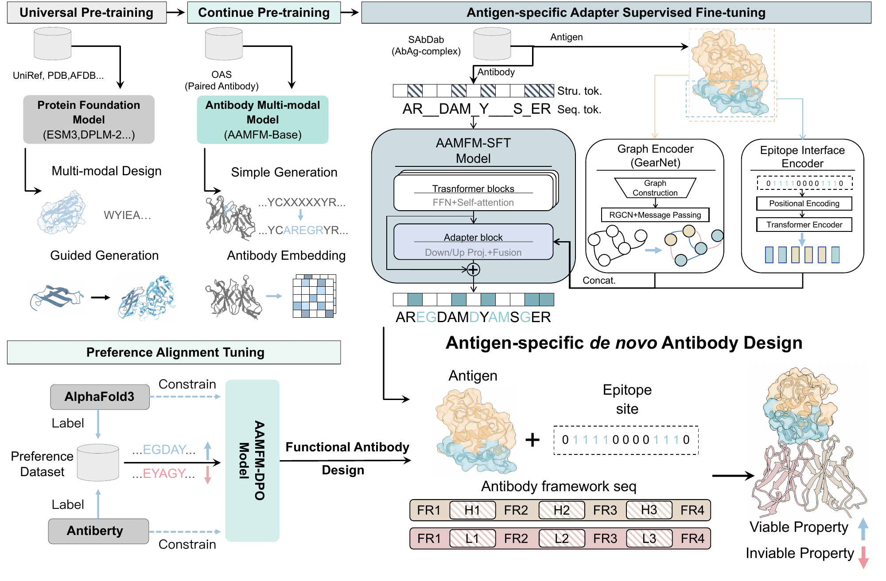

# AAMFM: Antigen-specific Antibody Multi-modal Foundation Model

[](https://arxiv.org/abs/2607.20057)
[](https://huggingface.co/GENTEL-Lab/AAMFM)

Official implementation for [*Antigen-specific Antibody Multi-modal Foundation
Model for Functional Antibody Design*](https://arxiv.org/abs/2607.20057).

<p align="center">
  
</p>
<p align="center"><em>Figure 1. Hierarchical training and inference pipeline of AAMFM.</em></p>

## Overview

AAMFM is an antigen-conditioned, multi-modal foundation model for functional
antibody design. It jointly models antibody sequence and structure while
conditioning on antigen geometry and epitope annotations. The training pipeline
progresses from antibody-domain adaptation to antigen-specific supervised
fine-tuning, followed by calibrated preference optimization for functional
design.

At inference time, AAMFM takes an antigen, an epitope-site mask, and antibody
framework sequences as input, and generates CDR sequences together with the
complete antibody structure.

## Method

1. **Antibody-domain continual pre-training (CPT).** A general protein
   foundation backbone is adapted to paired antibody sequence--structure data.
2. **Antigen-specific supervised fine-tuning (SFT).** A lightweight
   geometric--epitope-aware adapter fuses precomputed antigen graph features
   with epitope information for CDR sequence--structure design.
3. **Preference alignment (Cal-DPO).** Preference pairs are derived from a
   structure-based functional signal and an antibody pseudo-log-likelihood
   plausibility constraint, then used to align the SFT model.

## Installation

```bash
conda create -n anti_design python=3.10
conda activate anti_design
pip install -r requirements.txt
```

The release requires CUDA-enabled PyTorch, a compatible base-model backend,
and its externally supplied weights. Structural evaluation additionally
requires [US-align](https://zhanggroup.org/US-align/).

## Checkpoints and data

| Asset | Availability | Expected location or use |
| --- | --- | --- |
| AAMFM checkpoints | [Hugging Face](https://huggingface.co/GENTEL-Lab/AAMFM) | Set the checkpoint path for generation or training. |
| Training data | External | Provide the raw and processed artifacts required by the selected training configuration. |
| RAbD metadata and reference PDBs | Included | `datasets/eval/rabd/rabd.json` and `datasets/eval/rabd/pdb/` |
| GearNet antigen features | [Google Drive](https://drive.google.com/file/d/1-7247YaN0UkPlvvqqKIuMQPj-Y85Tj9Z/view?usp=sharing) | Download to `datasets/eval/rabd/gearnet_node_features.pt`. |
| US-align executable | External | Place at `tools/USalign`, or pass its path to the evaluator. |

The large GearNet feature file is intentionally excluded from Git. RAbD entries
that have no precomputed feature use the generation wrapper's explicit
zero-feature fallback; all fallback IDs are recorded in
`generation_manifest.json`.

## Training

Configure the external paths for the stage you intend to run, then launch from
the repository root:

```bash
# 1. Antibody-domain continual pre-training
bash scripts/run_cpt.sh

# 2. Antigen-specific supervised fine-tuning
bash scripts/run_sft.sh

# 3. Preference alignment
bash scripts/run_dpo.sh
```

The default configuration files are `src/cpt/config/CPT.yaml`,
`src/sft/config/SFT.yaml`, and `src/dpo/config/DPO.yaml`. Set the `null`
external data and model-path fields needed by the stage before launching it.

## Generation and evaluation

```bash
# Set externally supplied assets for this shell.
export CHECKPOINT=/path/to/checkpoint
export ANTIGEN_FEATURES=datasets/eval/rabd/gearnet_node_features.pt

# Generate designs (GPU 0 by default).
bash scripts/run_generate.sh 0

# Evaluate generated structures and sequences.
bash scripts/run_evaluate.sh outputs/reference_logic/h3_t0.7 h3only

# Recompute AntiBERTy PLL for a generation CSV.
bash scripts/run_compute_pll.sh outputs/reference_logic/h3_t0.7/generation.csv
```

`run_generate.sh` supports environment overrides such as `OUT_DIR`, `CDR_MODE`,
`TEMPERATURE`, `NUM_TARGETS`, and `SAMPLES_PER_TARGET`. The evaluator reports
structure and sequence metrics; PLL is intentionally a separate post-processing
step so it can be run on any completed generation CSV.

## Repository layout

```
src/
  cpt/                          Continual pre-training
  sft/                          Antigen-specific supervised fine-tuning
  dpo/                          Cal-DPO preference alignment
  eval/                         Generation, evaluation, and PLL utilities
scripts/                        Stage and evaluation launchers
datasets/eval/rabd/             RAbD metadata and reference structures
assets/aamfm-overview.png       Paper Figure 1
```

## Citation

If you use AAMFM, please cite:

```bibtex
@article{shi2026aamfm,
  title={Antigen-specific Antibody Multi-modal Foundation Model for Functional Antibody Design},
  author={Shi, Xiaoliang and Wang, Zichen and Ma, Runze and Zhang, Zhongyue and Zheng, Shuangjia},
  journal={arXiv preprint arXiv:2607.20057},
  year={2026}
}
```

## License

The source code in this repository is released under the
[MIT License](LICENSE). Pretrained model weights, external datasets, and
third-party tools remain subject to their respective licenses and terms.
